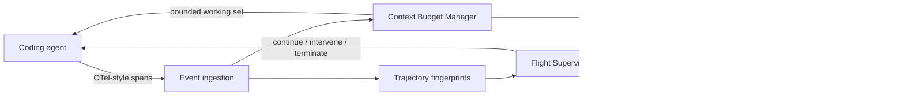

# Agent Control Room

An offline-first conference prototype that turns coding-agent telemetry into two runtime control systems:

1. **Agent Flight Recorder** — detects when a healthy process has stopped making useful progress and decides whether to continue, intervene, or terminate.
2. **Context Budget Manager** — treats working context as a bounded cache with admission, slicing, ranking, eviction, and evidence-driven reallocation.

Both systems operate on the same live OTel-style event trajectory. The UI is designed for a repeatable on-stage demo, while the ingestion API accepts events from a real agent harness.


## Run it

No install step is required.

```bash
npm start
```

Open [http://127.0.0.1:4318](http://127.0.0.1:4318).

For a hands-off kiosk/rehearsal mode, open `http://127.0.0.1:4318/?autostart&scenario=bad-hypothesis`.

Run the verification suite:

```bash
npm test
```

Stream sample OTel-style events from a second terminal:

```bash
npm run demo
```

## The conference demo

The default flow is deliberately theatrical but deterministic:

1. Launch **Healthy recovery**. Novel evidence, repository topology, and improving tests keep the recovery score high.
2. After the 17/18 test baseline, click **Force bad trajectory**.
3. Equivalent searches begin repeating. Novelty falls, the no-progress clock rises, and tokens accumulate without evidence.
4. The supervisor moves from `continue` to `intervene`, explains why, then opens the circuit.
5. Open **Counterfactual replay** to show exactly how many calls, tokens, and seconds the same unrestrained trajectory would waste.
6. Run **Persistent bad hypothesis** with the dynamic context policy. When the test contradicts `LegacyBackoff`, the working set evicts it and promotes the actual caller and clock dependency.
7. Repeat with **Append-only** context to show the distractor occupying budget after it has lost value.

See [docs/demo-script.md](docs/demo-script.md) for a timed presenter script and recovery plan.

## Architecture



### Flight Recorder signals

The supervisor uses a sliding execution window and records:

- normalized tool input/output fingerprints and result novelty;
- calls and tokens since the last measurable progress;
- repeated unresolved test results;
- edit/revert churn on the same file;
- tight same-tool loops;
- contradictions between tests and the current hypothesis.

Three policies are included:

- `heuristic`: transparent weighted rules;
- `judge`: a deterministic recovery-likelihood rubric, used as an offline stand-in for an LLM trajectory judge;
- `hybrid`: 62% heuristic score and 38% judge score.

The offline judge makes the stage demo reproducible. The decision boundary is isolated in `trajectoryJudge()` so an async model-backed judge can replace it without changing the signal pipeline.

### Context Manager policies

- `append`: first admitted, first retained; no eviction.
- `ranked`: continuously repacks by value per token.
- `dynamic`: ranked allocation plus strong promotions and contradiction-driven eviction.

Toggle **Symbol slices** versus **Whole files** to apply the granularity cost multiplier. Choose budgets from 4K to 32K and watch useful-context density change.

## Ingest real agent telemetry

Send one normalized event per model turn or tool span:

```bash
curl -X POST http://127.0.0.1:4318/api/v1/events \
  -H 'content-type: application/json' \
  -d '{
    "runId": "trace-42",
    "spanId": "span-7",
    "tool": "test",
    "title": "Run retry integration test",
    "input": "node --test retry.integration",
    "output": "17 passing, 1 failing",
    "tokens": 384,
    "durationMs": 902,
    "test": { "passing": 17, "total": 18 },
    "evidence": ["baseline 17/18"]
  }'
```

The response is itself a control signal:

```json
{
  "runId": "trace-42",
  "seq": 7,
  "decision": "intervene",
  "score": 51,
  "intervention": "Summarize the failing assertion, discard the current hypothesis, and inspect its nearest caller."
}
```

Common OpenTelemetry GenAI attributes are also recognized:

| Incoming attribute | Internal signal |
|---|---|
| `gen_ai.tool.name` | tool type |
| `gen_ai.usage.total_tokens` | trajectory cost |
| `gen_ai.input` / `gen_ai.output` | normalized result fingerprint |
| `code.filepath` | edit/read churn and context affinity |
| `duration_ms` | counterfactual elapsed time |

See [docs/integration.md](docs/integration.md) for the full schema and adapter guidance.

## Datadog export

The dashboard never requires network access. If `DD_API_KEY` is set, supervisor decisions and context metrics are additionally forwarded to Datadog logs intake:

```bash
DD_API_KEY=... DD_SITE=datadoghq.com npm start
```

Useful facets include:

- `@agent.supervisor.decision`
- `@agent.supervisor.score`
- `@agent.context.density`
- `@agent.context.used_tokens`
- `@agent.tool`
- `@run_id`

This lets the demo show the same runtime control signal next to the original GenAI trace without making the local demo dependent on Datadog availability.

## API

| Method | Endpoint | Purpose |
|---|---|---|
| `GET` | `/api/config` | scenarios and available policies |
| `POST` | `/api/runs` | launch a deterministic live run |
| `GET` | `/api/runs/:id` | inspect a run and its full timeline |
| `POST` | `/api/runs/:id/control` | `pause`, `resume`, `step`, or `inject-failure` |
| `POST` | `/api/replay` | supervised/unrestrained comparison |
| `POST` | `/api/v1/events` | ingest a real normalized OTel event |
| `GET` | `/api/stream` | live Server-Sent Events stream |

## Why one repository?

Progress evaluation and context allocation are coupled in real agents. A failed test is simultaneously:

- evidence that the current plan may be stagnating;
- a reason to promote the failing test and caller into context;
- a reason to evict the contradicted implementation;
- and a possible intervention point before termination.

Keeping both experiments in one control room makes that feedback loop visible while still allowing each talk to focus on one subsystem.

## Project layout

```text
src/
  supervisor.js          progress signals and decisions
  context-manager.js     bounded working-set allocator
  scenarios.js           deterministic demo trajectories
  run.js                 live execution and replay engine
  server.js              HTTP, SSE, and ingestion API
  datadog-exporter.js    optional Datadog log export
public/                   dependency-free conference UI
examples/                 external telemetry producer
test/                     deterministic behavior tests
docs/                     demo and integration guides
```

## Prototype boundaries

The simulator models a coding-agent trajectory; it does not edit this repository or invoke a hosted model. Real harnesses integrate through `/api/v1/events` and use the returned decision as their circuit-breaker signal. The included judge is intentionally deterministic for offline demos; production use should calibrate thresholds against labeled historical trajectories and can replace the judge function with a model-backed evaluator.

## License

MIT
